# Page

## 9 Internal Workflows

In this section, we identify workflows to manifest some of the main services. These may be enhanced or customized as needed for specific implementation needs. The following common preconditions may need to be met before utilizing these services:

Entities are registered and active in the system.

Currently, acting entities will be logged in the system and have sufficient roles to act.

The Initiator Building Block and the target block must be registered in the system as network participants with status as subscribed and should be active.

This section captures the example workflows that may take place between internal functional blocks to orchestrate key functionalities for a minimum viable product as follows. The exact workflows may be decided depending on implementation time considerations.

* User search for product/service from a provider platform.
* Viewing an item from the provider catalog.
* Inventory management.
* Selection of the product.
* Initiation of the purchase request.
* Confirmation of the order.
* Checking the status of the order.
* Cancellation of the order.
* Tracking of an active order.
* Feedback for an order.
* support for an order.
* Catalog management.

### 9 Order Lifecycle Workflows

#### 9.1 Searching for Items

The search flow allows consumers to search for available products or services. When a consumer initiates a search request, the catalog providers relevant products or services available respond to the search request by sending back detailed information about their offerings. This includes product details such as descriptions, images, specifications, prices, and any applicable offers or promotions.

#### 9.2 Catalog Management

This allows the creation of a catalog for a product or a service based on the request made by the user. This allows users to update the catalogs of a product or service. New attributes can be added or removed from a catalog.

Users while searching for products can request the catalog of the product or the services, and the platform will fetch and serve back user with the required catalog.

#### 9.3 Inventory Management

This enables users to manage inventory of the products also they can add or remove products from the inventory.

#### 9.4 Quotation Management

The consumer utilizes the internal workflow within the platform to explore and select from a range of available offers and attributes. These choices have an impact on the pricing, as different combinations can result in varying costs.

Once the consumer has made their selections, the consumer platform sends a request to the provider platform. The purpose of this request is to validate the chosen offers and attributes against the provider's system.

The provider platform conducts the necessary validation checks to ensure the selected offers and attributes are accurate and permissible. If any discrepancies or changes are identified, the provider platform communicates this information back to the consumer.

Upon receiving the feedback from the provider platform, the consumer can review the changes and make any necessary adjustments or confirm the modified selections.

This internal workflow allows the consumer to have control and flexibility in selecting offers and attributes, while also ensuring that the provider's systems validate the choices for accuracy and feasibility.

```mermaid
sequenceDiagram
    Actor consumer
    box Beckn-ONIX-BAP
    participant BAP Quotation Management
    end
    box Beckn-ONIX:BPP
    participant Quotation Management
    participant Inventory Management
    end
    consumer-->>BAP Quotation Management: select items <br/> from catalog
    BAP Quotation Management->>Quotation Management:request <br/> quote
    Quotation Management->>Inventory Management: check availability
    Inventory Management->>Quotation Management: return availability
    Quotation Management->>BAP Quotation Management:return quote <br/> with breakup
    BAP Quotation Management-->>consumer: view quote <br/> with breakup
```

#### 9.5 Initializing an order by providing billing and fulfillment details

The consumer carefully reviews the contents of their cart, ensuring that everything selected is accurate and satisfactory. Once satisfied, the consumer initiates a checkout call, indicating their intention to proceed with the payment. This action finalizes the cart, preventing any further modifications.

The consumer platform then sends a request to the provider platform to initialize the payment process for the products or services in the cart. In response, the provider platform generates a payment link and presents the consumer with additional terms and conditions related to the payment.

The payment link serves as a gateway for the consumer to complete the transaction securely. It directs them to a designated payment page where they can input their payment information and finalize the purchase.

Alongside the payment link, the provider platform communicates any specific terms and conditions associated with the payment, ensuring that the consumer is aware of any applicable fees, refund policies, or other relevant details.

#### 9.6 Confirming an Order

Once the consumer receives the payment link and reviews the terms and conditions, they proceed to make a payment. Upon a successful transaction, the consumer platform initiates a confirmation call to the provider platform. This call serves as a notification that the payment has been completed and confirms the order placement.

The provider platform acknowledges the confirmation call and responds with a success message. Along with the success message, the provider platform shares the details of the order that has been placed. These order details typically include information such as the order ID, items purchased, quantity, price, and any additional relevant data.

The consumer can then utilize the order details received from the provider platform to further check the status of their order. This information allows the consumer to track the progress of their order, anticipate the delivery, and stay informed about any updates or changes related to the order.

#### 9.7 Checking the status of an order

Once an order is confirmed, the user receives the details of the confirmed order, and they have the option to check the status of their order. The order status typically includes stages such as "placed," "packed," "dispatched," and so on. The "placed" status indicates that the order has been successfully received and recorded. The "packed" status signifies that the items in the order have been gathered and prepared for shipment. The "dispatched" status indicates that the package has been handed over to the delivery service for transportation.

**9.7.1 User explicitly requests for the fulfillment status of the order**

**9.7.2 Provider's Agent asynchronously updates the fulfillment status of an order at their end**

#### 9.8 Tracking the fulfillment of an order

When a consumer places an order and it is confirmed, they are provided with the option to track the status of their order. This tracking feature allows the consumer to stay informed about the progress of their purchase. The order status typically encompasses various updates related to the delivery process, giving the consumer insights into the whereabouts and estimated arrival time of their package.

One of the primary aspects of the order status is the delivery status, which indicates whether the package has been dispatched from the provider's location or the warehouse. It confirms that the order is on its way to the consumer. This status assures the consumer that their purchase is in the process of being delivered.

**9.8.1 Update Agent's tracking information**

Users can update the tracking status of an order.

**9.8.2 Tracking an order**

Users can request to get the tracking status of an order.

#### 9.9 Updating an Order

**9.9.1 Consumer-initiated update**

**9.9.2 Provider Initiated Update**

#### 9.10 Cancelling an Order

When a consumer places an order and it is confirmed, they are provided with the option to cancel their order. This will allow the user to cancel the order before receiving an order.

**9.10.1 Consumer initiated cancellation**

**9.10.2 Provider Initiated Cancellation**

#### 9.11 Rating and Feedback Management

This allows users to rate any rate-able entity in the system, it can be a product, service, agent, etc. Users can also provide detailed feedback on the entities.

**9.11.1 Rating an Order (without feedback)**

**9.11.2 Rating an order with feedback**

#### 9.12 Support Management

Users can request support, this can happen anytime during the lifecycle of an order.

